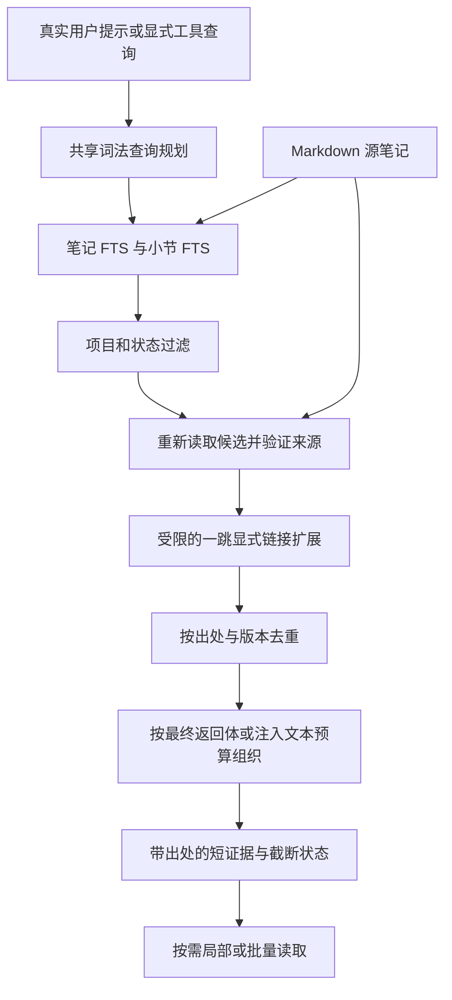

# 记忆检索与上下文消耗优化设计

**日期：** 2026-10-05

**状态：** 设计草案；配套实施计划已撰写，生产实现与效果评测尚未执行。

**范围确认：** 用户选择首版先做无需模型的优化，语义检索列为后续阶段。

**基线：** 本次源码检查时的仓库 HEAD 为 `e76c231`；工作区存在其他未提交修改。实施前重新核对 HEAD、工作区、接口和工程门禁，不能把这个提交号当作永久基线。

**实施计划：** [2026-10-05-memory-retrieval-efficiency.md](../plans/2026-10-05-memory-retrieval-efficiency.md)

## 1. 决策与范围

采用渐进式读取、小节级词法索引和有总预算的组合上下文。Markdown vault 仍为唯一权威内容来源，SQLite 和会话召回状态均可重建。DSH 与 Codex 共用 `lib/` 的读取、查询规划、上下文组织和去重策略，适配器只处理宿主事件与协议。

首版包括真正的局部读取、最多八篇的有界批量读取、紧凑检索结果、小节检索、显式链接的一跳扩展、精简会话简报和版本感知的逐轮召回。它不调用 embedding、重排模型或读取侧 LLM，不增加运行时依赖，不修改源笔记、不执行整理提案、不新增第七个 `mem_*` 工具。

首个发布的自动注入默认仍使用 `retrievalMode: 'legacy'`。`focused` 为显式可选模式；新工具参数可以独立使用。后续将自动模式改为默认，需要另一个有实测依据的发布决定，不属于本计划。这个选择允许对同一组输入比较两条路径，也保留低成本回退。

### 方案比较

| 方案                                   | 收益与代价                                                     | 决定                             |
| -------------------------------------- | -------------------------------------------------------------- | -------------------------------- |
| 只修局部读取与缩短目录                 | 接口改动较少，但检索单位仍是整篇，不能减少跨工具探索           | 可独立交付的起点，不作为完整目标 |
| 兼容的局部读取 + 小节索引 + 组合上下文 | 同时减少冗余输出和往返次数；需要索引、协议及双适配器验证       | 首版采用                         |
| 首版加入向量、自由查询扩展和模型重排   | 可能改善同义表达，但引入模型选择、下载、推理延迟和新的失败方式 | 后续独立设计与评测               |

## 2. 当前证据与问题

本节是 2026-10-05 的源码观察和一次隔离探针，不是新功能的通过记录。

- `lib/services.js:toNoteView` 始终返回全文 `body`，指定章节时又附加 `sectionBody`。通过 `codex/server.mjs:callMemoryTool` 在临时 vault 读取人工笔记，选中章节为 31 字符，实际 JSON 结果为 11,695 字符；仅保留章节、路径及哈希的人工投影为 170 字符。这证明返回体存在重复，不证明真实模型 token 成本降低了 98.55%。
- `lib/brief.js:buildBrief` 使用 6,000 码点默认预算，组织热层、hub、约定目录、整理视图、近期记忆与偏好。本轮收到的简报标记为 `5960/6000 chars`；目录中长路径和标题有重复表达。
- `lib/prompt-recall.js:promptRecall` 默认检查八条、投递三条，独立逐轮预算为 900 码点；长提示词的首六与末十个检索词可能丢失中间主题。
- 查询词由共享 CJK bigram/Latin tokenizer 生成，没有读取侧语义模型；短追问的指代信息不在当前提示词里。
- 逐轮去重以路径为单位。同一笔记的另一小节或编辑后的版本，不能仅因路径曾出现就长期抑制。
- `lib/index-db.js` 已有 FTS5、链接表和源文件哈希校验；`lib/graph-data.js` 的展示图按连接度选点、且可展示历史状态，不宜直接成为自动召回候选集。
- 已有自动整理的精简视图只能提供经过来源验证的导航。本设计不生成另一套模型摘要，也不修改该功能的提案执行边界。

## 3. 全局约束

1. `engines.node` 保持 `>=22.22.2`，不增加运行时依赖；运行时依赖仍是 `@deepseek-ai/schemastery` 和 `yaml`。
2. ES modules、`node:` 内置模块、两空格、单引号、无分号；导出函数写 JSDoc。
3. 六个工具名称及 `lib/tools.js` 再导出门面保持不变。旧调用的输入语义和返回形状保持兼容，包括指定旧 `section` 时的旧全文结果。
4. 所有缓存和会话状态在 `resolveDataRoot()` 派生的数据根下。测试和探针只使用临时 vault、临时 home、临时 `DSH_HOME`；不读取真实 vault 做评测。
5. 不修改真实 DSH/Codex 配置；不安装 Git hooks；`prepack` 仅验证。提交不含 `Co-Authored-By`。
6. `README.md` 与 `README.zh.md` 同步，更新 `README.i18n.yaml` 的两侧 blob hash；两份便携技能同步描述工具新参数。
7. 索引、整理视图和召回缓存不能授权源笔记修改。历史引用是数据，当前用户指令优先。
8. 源哈希验证、路径 jail、项目过滤、历史状态过滤、取消处理和显式截断不能为了性能被省略。
9. 新模块加入 `test/architecture.test.js` 的层级与预算；带 `// @ts-check` 的模块加入 `tsconfig.json`。不通过大范围提高层级或预算隐藏依赖问题。
10. 宿主事件及注入时机以 `docs/p0-compatibility.md` 为依据。协议测试和真实会话投递分开记录。

## 4. 数据流



默认的旧 `mem_search` 与旧 `mem_read` 不进入新返回投影。`focused` 自动召回进入同一个组合上下文核心，再通过共享文本渲染器转为引用数据消息。图关系只用于补充候选；最终事实仍来自当前源文件。

## 5. 工具契约

### 5.1 `mem_read`：保留旧契约，增加显式摘录模式

旧 `{path, section?}` 原样返回现有 Note。新增 `view: 'excerpt'` 后才进入新契约，结果不带全文 `body` 或完整 `frontmatter`。

| 参数             | 规则                                                                          |
| ---------------- | ----------------------------------------------------------------------------- |
| `path` / `paths` | 恰好提供一个；`paths` 为 1..8 个互不重复的 vault 相对 Markdown 路径           |
| `view`           | 缺省为旧读取；批量 `paths` 必须显式指定 `excerpt`                             |
| `section`        | 摘录模式可指定 ATX 标题；与 `fromLine`、`maxLines` 互斥；批量时应用于每篇笔记 |
| `fromLine`       | 摘录行区间的起点，缺省 1，正安全整数                                          |
| `maxLines`       | 缺省 40，范围 1..200；没有 `section` 时使用                                   |
| `maxChars`       | 摘录结果的全局 JSON 预算，缺省 4,000，范围 512..24,000；旧读取不接受          |

行号相对于解析后的 Markdown `body`，不含 YAML frontmatter。结果必须标明 `lineBase: 'body'`，不能把它宣传为原文件绝对行号。旧章节匹配规则不变；新摘录遇到多个同名 ATX 标题报 `ambiguous-section`，通过行区间消歧。父章节读取包含子标题，直到下一个不高于父级的标题。

新返回形状：

```js
{
  view: 'excerpt',
  notes: [{ path, hash, lineBase: 'body', fromLine, toLine, text, truncated }],
  errors: [{ index, code }],
  meta: { chars, maxChars, omittedNotes, omittedErrors, truncated }
}
```

错误码为 `not-found`、`unsafe-path`、`section-not-found`、`ambiguous-section`、`range-not-found`、`too-large`、`read-failed`。fromLine 超过 body 总行数时为 range-not-found；空 body 视为一条空行。全局取消遵循现有异常语义，不返回一个可被误认为完整的成功批次。单篇缺失可以返回局部批次，但计入错误；预算无法容纳的错误计入 `omittedErrors`。一条完整正文行无法放入剩余额度时整行省略，`truncated: true`；不截掉半条约束伪装成完整证据。

手动读取的访问范围与现有 `mem_read` 相同，并不新增项目限制；自动组合上下文必须额外遵守检索 scope。只有已投递的摘录才能推进投递状态。文件已变化时返回新哈希及新正文，不服务旧缓存正文。

### 5.2 `mem_search`：三种明确视图

新增 `view: 'hits' | 'compact' | 'context'`，缺省为 `hits`。

- `hits`：保持现有 service 数组、DSH `{hits}` 包装和 Codex 当前结果形状，现有评分信号不变。
- `compact`：返回 `{view:'compact', hits, meta}`；每条只含 `path/title/hash/snippet`，不重复全部评分和 frontmatter 字段。使用相同 scope/status 过滤和来源验证。
- `context`：返回 `{view:'context', entries, meta}`；包含少量可直接使用的小节证据和必要的关系出处，不附加整篇正文。

`compact/context` 的 `maxChars` 缺省 4,000，范围 512..24,000。`context` 的 `limit` 缺省 3，最大 8；`relatedLimit` 缺省 1，范围 0..3，且扩展条目算在 `limit` 和总预算内。`hits/compact` 不接受 `relatedLimit`。旧 `hits` 不接受 `maxChars`，避免一个表面有效、实际无效的参数。

hits/compact 缺省 limit 仍为 8、最大 50。参数表不能给所有视图注入静态 limit=8：移除该字段的 DSL 静态 default，描述中说明两种默认值，由共享服务按 view 补齐；旧调用运行语义不变。DSH registration 仅给旧数组包装 `{hits}`，新信封直接透传，不能套成 `{hits:{view,...}}`。

```js
{
  view: 'context',
  entries: [{
    path, hash, sectionId, title, lineBase: 'body', fromLine, toLine,
    text, kind: 'seed', via: null, signals: ['section-match']
  }],
  meta: {
    chars, maxChars, omitted, truncated, backend,
    candidatesScored, sourceRejected, relatedRejected, fallbackReason
  }
}
```

`kind` 为 `seed/related`；相关条目的 `via` 为种子路径。`signals` 最多三项，使用封闭词汇：`title-exact`、`section-match`、`alias-match`、`body-match`、`explicit-link`、`note-fallback`。来源被删除、修改后已不匹配或越界，计入 `sourceRejected`，不得返回旧事实。`fallbackReason` 为 `null`、`section-limit` 或 `section-index-unavailable`；降级到可验证的旧笔记候选时标记 `note-fallback`。

compact 的 `meta` 固定为 `{chars,maxChars,omitted,truncated,backend,candidatesScored,sourceRejected}`。新模式的显式空结果也保留这些字段。旧 hits 的未枚举数组元信息不改为一个新信封。

DSH 参数 DSL 与 Codex schema 由同一参数表生成；`path/paths` 互斥、视图对应参数和安全整数范围由共享服务校验，两边都可到达。新结果用闭合 schema，旧 Note schema 保持不变。禁止复制一套仅在 Codex 生效的验证规则。

## 6. 预算的真实含义

`maxChars` 是对最终工具结果 `JSON.stringify(result)` 的 Unicode 码点预算，包含路径、字段名、标点、错误和 `meta`；不包含 JSON-RPC 信封，也不声称涵盖宿主额外包装。注入预算则按最后送出的引用消息文本计数，包含表头、路径和引用前缀。两者分别测量，不能先截正文后忽略包装。

`meta.chars` 自身影响长度，序列化助手必须求稳定计数；候选加入、遗漏计数增长后都重新测量。超限时从低优先级末尾移除完整单位，更新遗漏数，再检查最终结果。最小必要信封仍放不下则报 `budget-too-small`，不返回超预算成功结果。

这个首版不新增强 token 上限，也不把 `chars/4` 写成实际 token。评测可以接收已安装、标明模型与版本的 tokenizer，或使用宿主真实 usage；不可得时 token 为 `null`。报告分开列返回体字符、token、工具往返数、缓存计费和会话中残留的检索上下文。

## 7. 小节索引与查询规划

### 7.1 小节与窗口

新增 `lib/markdown-sections.js`，负责在 body 中识别围栏外的 ATX 标题、同名标题序号和正文行范围。围栏、空白、子标题和无标题笔记必须有测试。首版不把 Setext 标题当作结构，它保留为普通正文，旧读取不改变解释。

索引窗口优先按完整段落组合，正文最多 1,200 码点；过长单行按精确字符串区间切窗，保留源码 offset 和所属行，不改写正文。`startOffset/endOffset` 是 JS UTF-16 字符串索引，仅作内部源切片定位；公开行号仍是 body 行号。小节 key 由路径、标题层级、同名序号与窗口序号生成 SHA-256 的前 24 个十六进制字符；任何投递 key 仍包含完整源哈希。

每篇最多索引 256 个窗口；超出时记录该篇 `sectionsTruncated`，仍保留旧整篇 FTS，不能把后续正文当作不存在。候选验证发现文件变化，要重建该篇的小节并重新匹配；不能沿用旧 offset 切新文件。

### 7.2 SQLite 与 scan

新增 `sections`、`sections_fts`，存储来源 path/hash、section key、标题、范围、窗口及同一 tokenizer 的 tokens。小节分表实现放在 `lib/section-index.js`，由 `index-db.js` 注入数据库句柄及已有候选验证能力。`section-index.js` 不反向 import `index-db.js`。

笔记更新、小节删除与重建在同一 SQLite 事务中完成。缓存 schema 版本递增，复用现有旧版本隔离与重建路径，不迁移源笔记。`scan` 后端生成相同窗口，沿用现有扫描行数上限与显式截断，不无界遍历 vault。未就绪索引仍是错误状态，不是空结果。

新 `index.searchSections(options)` 和 `index.neighbors(options)` 使用与旧 search 相同的 scope/status/type 过滤。整篇与小节两路候选各最多 24，先按自身顺序做 rank fusion，常数 `k=60`；完整标题精确命中优先，type/freshness 只用于相同融合分数的次序。首版不修改旧 `hits` 评分。最终最多验证 24 篇不同源文件，剩余候选标明截断。

### 7.3 查询规划

新增 `lib/retrieval-query.js`，提供 `planRecallQuery(prompt, options)`。只接受真实用户文本；围栏代码不进入自然语言词组。保留现有 tokenizer 和最多 16 个检索词；长提示词改为首四、中间均匀八、末四，去重后不足 16 不补泛词。中间取样采用稳定索引，不能依赖随机或模型。

这是待评测的采样规则，不保证恢复任意位置的主题。开发集若显示漏检或前部主题回归，先保留失败样例并在开发阶段调整确定性规则；不得为了通过验收修改人工标签。

索引可利用源 frontmatter 中既有 `aliases`：最多八个非空字符串，每个最多 64 码点，其内容仍是数据。别名只增加该笔记及窗口的词法候选，不生成新的同义词，不修改 frontmatter，也不能绕过 scope/status 过滤。

对于严格匹配 `继续/继续吧/接着/那个方案/上一个方案` 的短追问，仅当上次实际投递的引用仍通过源哈希验证，才从最多三条引用对应的小节标题与标题提取检索词。没有可验证引用时仍静默。不持久化历史提示词，不扫描宿主完整会话；此功能只能延续上次召回主题，不能宣称恢复任意对话指代或判断最近完整对话主题。产品文档必须保留这个限制。

## 8. 组合上下文与显式关系

新增 `lib/memory-context.js`，组合新小节检索、旧笔记候选与摘录投影。它不依赖 `services.js` 或宿主，也不调用展示图 `projectGraph`。显式工具查询不额外套用逐轮召回闸门；自动召回使用现有精度闸门，新增别名/小节标题只作为可审计的词法证据，不得仅降低下限制造“更多命中”。

核心只切片刚通过验证的 body：先比对完整源 hash，再使用该版本窗口的 offset。不能拿旧窗口定位新文件。context 可以返回完整索引窗口，包括标记范围的长行切窗；若预算不足则省略整个窗口。`mem_read` 的完整行省略规则不因此改变，两种读取单位必须在测试中区分。

一跳扩展只使用种子源文件中真实存在的 wikilink，最多检查 12 个链接目标，最终补入最多 `relatedLimit` 条。解析复用 `lib/graph-links.js`；模糊或未解析目标计入拒绝数。上下文中的所有条目使用同一个已解析 scope/type/history 过滤器，跨项目或历史目标不能因为被链接就自动进入。`index.md` 和项目 `_meta/hot.md` 不作为扩展证据，前者是目录，后者已有常驻投递。

相关条目只能说明“种子链接到这篇”，不能把普通链接推断成因果、支持或替代关系。每个条目包含新鲜来源 hash 和可读取路径。种子优先于扩展项，每篇默认最多两段，总量受 `limit` 和全局预算限制。不同路径的笔记不能仅因标题相同或正文相近被折叠；已有整理的精确显示分组继续使用自己的来源验证规则。

## 9. 精简简报与逐轮投递

### 9.1 精简简报

配置新增 `retrievalMode: 'legacy' | 'focused'`，缺省 `legacy`。DSH 使用标准 Config；Codex 的 `openMemory` 增加显式 `retrievalMode` 选项，并统一读取可选环境变量 `OBSIDIAN_MEM_RETRIEVAL_MODE`。非法值必须报错；hook 捕获后继续当前用户任务，不能悄悄解释成 focused。生成安装配置不写入该变量。

focused 简报保留绑定、引用数据声明、热层强约束/进行中、用户偏好、索引状态和可达目录；约定目录用一个 `Conventions/index.md` 入口代替逐条长标题。近期导航最多三项，来自已有源读取或经过验证的整理视图。每条路径和标题各出现最多一次，不引入必须另查表的短 ID。

紧凑目标为 `min(briefBudgetChars, 1800)`。必要区放不下时可扩展至用户已有 `briefBudgetChars`，记录 `mandatory-over-target`；仍放不下时沿用现有完整块省略、`truncated/omitted` 和热层快照重试语义。1,800 是工程目标，不是全部强约束总能放入的保证。compact 省略数包含被目录入口替代而未逐条显示的导航项，文案说明可以按需查询，不等同于删除笔记。

delta 模式保持现有热层哈希变化触发及完整投递后才推进快照的规则；只因常驻文本缩短不能重发全量简报。损坏、过期或不完整整理视图继续回退源路径。

### 9.2 逐轮召回与状态

focused 的自动召回从共享组合核心取候选，再按最终消息的 `recallBudgetChars` 渲染，默认仍为 900 码点、最多三条。每条包含可用短证据和完整 vault 相对路径，所有源内容以引用数据呈现；不能只给 ID 期待模型自行读取，也不能注入整篇正文。

精度闸门的直接匹配是完整规范化 query 在当前标题、小节标题、既有 alias 或正文中的匹配；否则要求当前证据的 query token 交集达到旧 floor（最少三、最多四）。仅带 `section-match/body-match` 标签不足以免除 floor。别名短 query 的直接匹配必须有完整别名证据，不能把任一词的 overlap 当成完整别名命中。

内部 `services.recall({prompt,state},signal,exec)` 统一项目解析、组合核心与自动精度闸门；它不是 MCP 工具，不加入 `TOOL_NAMES/SERVICE_KEYS` 的六个工具映射。focused 决策包含实际渲染的 `entries`，适配器在 DSH 消息入队或 Codex additionalContext 输出后才调用 `advanceRecallState`。没有消息或失败时不提前登记。legacy 仍使用原有逐轮路径。

投递 key 为 `sha256(path + '\0' + sourceHash + '\0' + sectionId + '\0' + excerptHash)`，其中 `excerptHash` 为实际投递证据的哈希。不同版本、不同小节或不同证据允许再次投递；同一证据不重复。投递 key 只在最终消息确实包含该条目后登记。目录导航不等于正文已投递。

新增 `lib/recall-state.js`，统一状态格式、验证和私有文件 IO。DSH 保存在进程内，Codex 的每轮 hook 保存到现有数据根下的哈希 session 文件。v2 状态仅包含 version、projectId、最多 64 个 key、最多三条 `{path,hash,sectionId}` 引用；不包含用户提示、正文、标题或检索词。旧 `{paths}` 状态迁移为“不抑制新摘录”，一次重复投递比永久漏掉新版证据更可接受。

路径/版本不符、符号链接、超 32 KiB、JSON 损坏和项目变化均清空该召回缓存，不阻塞任务。文件目录 `0700`、文件 `0600`，使用独占临时文件和原子替换。状态是提示缓存，不是事务：并发同 session 的写入允许保守的重复召回，不能依赖它保证强一致性或授权写笔记。不同 session 或项目不能复用引用。

MCP-only 仍只能显式查工具。没有受信 hook 时不能宣称 Codex 自动投递可用；不从测试或工具注册推断真实模型已收到消息。

## 10. 模块与接口

| 模块                                                      | 责任与接口                                                                                                                                                           | 依赖层级/初始行数预算                                                        |
| --------------------------------------------------------- | -------------------------------------------------------------------------------------------------------------------------------------------------------------------- | ---------------------------------------------------------------------------- |
| `lib/retrieval-budget.js`                                 | `countChars(text)`、`serializedChars(value)`、`packPayload({items,maxChars,build})`、预算常数                                                                        | L0 / 200                                                                     |
| `lib/markdown-sections.js`                                | `extractMarkdownSections({path,body,aliases})`、`locateExcerpt(body,{section,fromLine,maxLines})`，返回源码范围                                                      | L0 / 300                                                                     |
| `lib/section-index.js`                                    | `createSectionSchema(db)`、`replaceSections(db,record,{tokenize})`、`removeSections(db,path)`、`selectSectionCandidates(db,plan,filters,limit)`                      | L1 / 350                                                                     |
| `lib/read-projection.js`                                  | `readProjectedNotes({vaultRoot,paths,section,fromLine,maxLines,maxChars,home,signal})`，返回 excerpt envelope                                                        | L3 / 300                                                                     |
| `lib/retrieval-query.js`                                  | `planRecallQuery(prompt,{verifiedTopics})`，返回 `{query,kind}`，kind 为 direct/continuation/no-query                                                                | L3 / 200                                                                     |
| `lib/memory-context.js`                                   | `buildMemoryContext({index,vaultRoot,query,scope,type,projectId,includeHistory,limit,relatedLimit,maxChars,home,signal})`、`verifyRecallTopics({index,refs,signal})` | L4 / 350                                                                     |
| `lib/brief-navigation.js`                                 | `compactNavigation({relativeDir,recent})`，纯导航单位；不访问源文件                                                                                                  | L0 / 150                                                                     |
| `lib/recall-state.js`                                     | `emptyRecallState(projectId)`、`deliveryKey(entry)`、`advanceRecallState(state,entries)`、`loadRecallState(path,projectId)`、`saveRecallState(path,state)`           | L1 / 250                                                                     |
| 现有 `index-db/search/services/tool-schema/tool-registry` | 新索引接口、scope 复用、三种搜索视图、闭合返回 schema；门面不变                                                                                                      | 保持既有层级，新增导入只能向下                                               |
| 现有 `brief/prompt-recall/hooks` 与 Codex hooks/server    | 新模式和状态适配、实际引用渲染、配置及宿主协议                                                                                                                       | 仅 `prompt-recall` 从 L3 调整为 L5，以直接依赖 L4 组合核心；其他既有层级不变 |

`replaceSections` 只使用注入的 `record.path/hash/title/body/aliases`、tokenizer 和数据库句柄；它不自己读取 vault。`parseNoteRecord` 在读取 frontmatter 时增加规范化 `aliases`，不改变旧 FTS 的 tokens。`index.searchSections({query,filters,limit,signal})` 在来源验证后才输出 `{hits,meta}`，每个 hit 含 path/hash/sectionId/title/text/fromLine/toLine/signals/rank；内部额外保留当前源的 startOffset/endOffset。`index.neighbors({paths,filters,limit,signal})` 返回同结构的笔记候选，并标注 `via`。`index.recallTopics({refs,filters,limit,signal})` 对最多三条引用再次应用项目/状态过滤、源 hash 与小节 key 验证，只返回 `{title,heading}`，失败引用不贡献词组。

`searchSections(index, options)` 作为 `lib/search.js` 的新导出，像 `searchNotes` 一样先执行 `resolveScope` 与 readiness，再调用 index 接口。`services.search` 只在新视图时返回 envelope；旧参数仍返回旧数组。`readProjectedNotes` 和服务参数验证都使用同一套预算常数，输出 schema 不另写第二套数值。

`focusedPromptRecall({prompt,index,vaultRoot,state,maxChars,home,signal})` 是 `prompt-recall.js` 的新导出，返回 `{outcome,text,paths,hits,chars,entries}`；outcome 复用既有封闭词汇，entries 只含最终投递的证据。`verifyRecallTopics` 先 readiness 和 `resolveScope({scope:'project',boundProjectId:index.boundProjectId})`，再调用 `index.recallTopics`，不通过手动读取范围扩大自动召回权限。新查询规划、状态与渲染实现不改写 legacy 的测试基线。

新模块预算是初始工程上限，不是已测量行数。超出时先检查职责，确有必要的预算调整要在提交说明记录理由。不得顺带重构整个 `index-db.js` 或 `services.js`。

## 11. 失败与回退

| 情况                    | 行为                                                         |
| ----------------------- | ------------------------------------------------------------ |
| 索引未就绪、取消        | 保留现有区分明确的错误；自动 hook 继续用户任务并记录 outcome |
| 源文件改变/消失         | 丢弃旧命中，修复该篇缓存，重新匹配；无法确认时不投递         |
| 小节达到上限/索引不可用 | 保留旧整篇检索并标明 note-fallback，不假报空 vault           |
| scan 后端               | 有界地生成相同窗口；报告 backend 和候选截断                  |
| 一个局部读取失败        | 批量结果带封闭错误码和遗漏数，不声称所有笔记已读取           |
| 预算不足                | 先移除关联项和低优先级完整单位；不修改事实来满足长度         |
| 召回状态损坏/项目切换   | 清空提示缓存，允许再次召回；不改变源笔记或配置               |
| 整理视图过期            | 复用既有源验证回退；不触发语义整理或提案审批                 |

诊断只记录模式、阶段、封闭 outcome/code、计数、字符数、耗时与 backend。不记录查询文本、标题、摘录或路径。新增诊断字段同步到 `debug.js`、`diagnostic-codec.js` 的 allowlist 及测试；不得把工具结果复制进诊断日志。

## 12. 评测与验收

### 12.1 固定、隔离的评测材料

人工 fixture 的每条笔记和每条查询有固定 ID。至少 48 条查询，分为六组各八条：精确名词、中文/中英文 aliases、长提示词中间主题、章节读取、明确短追问、隔离与过期/无关内容。开发集与验收集各 24 条，每组各四条；设计参数只在开发集调，验收集只在候选定版后运行。相关性标签标到 path + section，不以实现返回结果反向生成答案。

包含同名不同数值、重复标题、围栏内伪标题、无标题笔记、256 窗口上限、编辑/删除/重命名、损坏 frontmatter、单字 CJK、一个巨长单行、未解析与跨项目 wikilink、历史笔记、恶意指令文本、空索引、scan 降级。每次评测核对源字节哈希，检索流程不得改写笔记。

### 12.2 发布验收门槛

- 安全与正确性：项目/历史过滤、来源哈希、路径 jail、截断、取消和旧契约全部通过。即使长度降低，任何越界或旧事实投递都阻断交付。
- 检索质量：旧 hits 和新 context 都按去重后的 path 排名计算 `Recall@3/MRR@3`，使用同一人工 path 标签；逐组不低于旧基线。新模式另算 path+section 的 `EvidenceRecall@3`，有明确小节标签的正例须全部返回正确小节，不能把旧模式没有小节字段当成旧模式的错误。隔离/无关组用拒绝及误投递率，不对无正例查询计算 MRR。无关条目投递率不得高于旧基线。
- 局部读取：人工长文的 excerpt 结果不带全文，每个成功结果确实在 maxChars 内；紧凑结果中路径及必要证据可直接定位。30% 字符缩减为长文 fixture 的目标，不能表述为所有笔记的保证。
- 精简简报：目录密集 fixture 在必要区相同的条件下，导航字符至少减少 30%；必要区较大的输入可以超紧凑目标，但不超过用户原预算，完整块/重试语义保持正确。
- 性能：在固定环境热缓存下重复 30 次，focused 自动召回 p95 不高于 legacy p95 的 `1.25 倍 + 20ms`；冷启动与 100/1,000 篇 fixture 单独报告。该阈值是发布工程门槛，不是当前实测承诺。
- token：只有实测 tokenizer 或真实宿主 usage 可以支持 token 成本声明；缓存输入与非缓存输入分开。缺失数据写 `null/unverified`，不凭字符比例补造。
- DSH/Codex：相同项目、源文件、模式和提示下，新核心返回相同来源集合；协议都保持合法。分别用一次真实隔离会话观察简报及逐轮消息，未跑的宿主列入 CHANGELOG 未验证项。
- 工程：运行 `npm run check`、`git diff --check`，检查真实 tarball；双 README 与双技能同步。保留失败样例，不改写历史 smoke/dogfood/P0 记录。

评测报告在 `docs/retrieval-efficiency-results.md`，只在真实运行后填写结果。它记录 fixture/标签哈希、代码 SHA、Node/宿主版本、命令、分组结果、字符/可得 token、延迟和未运行场景；不包含真实用户对话、模型原始输出或敏感路径。

## 13. 后续语义检索的准入条件

语义检索不在本计划的实现清单。先保存首版仍无法命中的同义表达和上下文依赖案例；只有证明词法 aliases 与小节索引不足，再建立独立 spec/plan。后续比较本地多语言 embedding、BM25+向量 RRF 与可选重排，测中文质量、模型体积、冷启动、推理延迟、离线和故障回退。向量只能产生候选，仍必须验证 vault 源文件，不能成为第二权威来源。

## 14. 参考与证据边界

以下官方仓库在 2026-10-05 调查过；外部数字不作为本插件效果。前三项源码链接固定到调查时 API 返回的 SHA；后两项是当日主分支文档链接，实施时需要重新核对。

- [CodeGraph context 实现](https://github.com/colbymchenry/codegraph/blob/511d86e94dc9f26e74e32741477b6ffaae1695a7/src/context/index.ts)：入口检索、有限关系扩展、来源块组合、每文件数量限制。[成本与残留上下文说明](https://github.com/colbymchenry/codegraph/blob/511d86e94dc9f26e74e32741477b6ffaae1695a7/README.md) 提醒总处理 token 与驻留上下文是不同指标。本机 CLI 包元数据是 0.9.5，不能用主分支的新能力描述这个安装版本。
- [QMD MCP 实现](https://github.com/tobi/qmd/blob/26b703c5daa8037df089a8104cbf7eeab4e51874/src/mcp/server.ts)：检索结果定位、局部读取和批量返回。[检索管道](https://github.com/tobi/qmd/blob/26b703c5daa8037df089a8104cbf7eeab4e51874/README.md) 用 BM25/向量/RRF/重排；首版只借鉴词法组合和输出控制，模型相关机制在后续评测。
- [Basic Memory build_context](https://github.com/basicmachines-co/basic-memory/blob/194afe165b3e7676496aaa53b70e39a78ea5aa4f/src/basic_memory/mcp/tools/build_context.py)：限定 depth、条数和紧凑关系输出；紧凑输出本身不保证总 token 上限。
- [Claude-Mem 搜索文档](https://github.com/thedotmack/claude-mem/blob/main/docs/public/usage/search-tools.mdx)：短索引、按需关系上下文、批量详情。这里只引用流程，不采用其宣传的节省倍数；链接为调查当日主分支页面。
- [Hindsight 官方实践](https://github.com/vectorize-io/hindsight/blob/main/hindsight-docs/src/pages/best-practices.mdx)：多路召回与时间维度，作为后续问题分类参考；不引入该服务或改变全局 Hindsight 配置。

直接复用第三方源码不在本设计范围；实现使用本仓库现有模块及 Node 内置能力。以本仓库的隔离评测与真实宿主证据决定是否发布。
